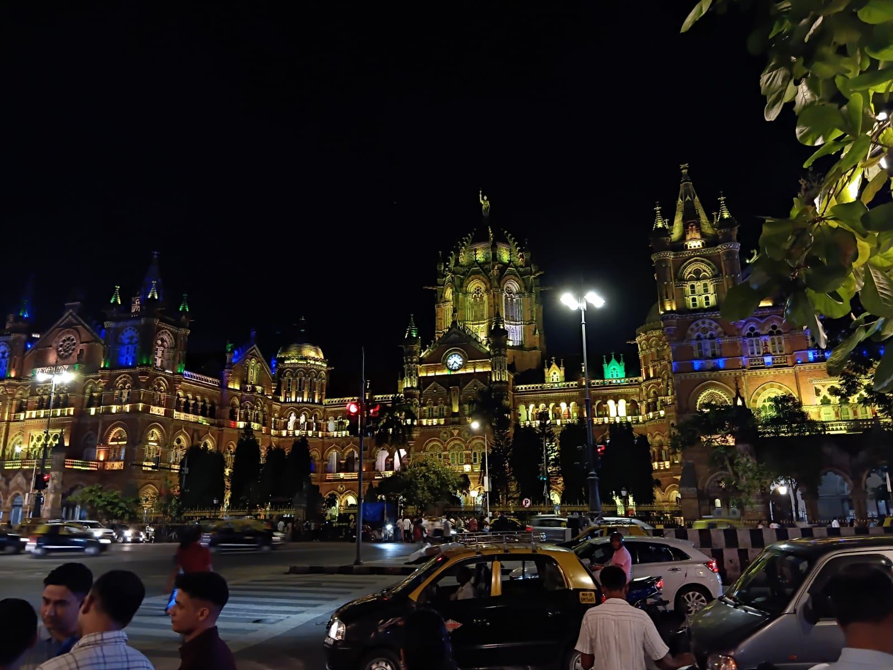

# ANAMIKA INTRODUCTION
Hello everyone, 
**I am Anamika Dasgupta**
I am currently pursuing my bachelor's degree in Electrical and Electronics Engineering from Visvesvaraya National Institute of Technology (VNIT), Nagpur.  

I am from Thane, Maharashtra.  

My father's name is Pranab Dasgupta. He is currently working at Tata Consulting Engineers (TCE).  

My mother's name is Susmita Dasgupta. She is a senior section Mathematics teacher at Smt. Sulochanadevi Singhania School.  

My hobbies include:

- Reading psychological thrillers
- Drawing
- Painting
- Writing poems in Hindi
- Listening to music

My goal is to pursue a career that I genuinely love and become the best version of myself in whatever path I choose in the future.  

